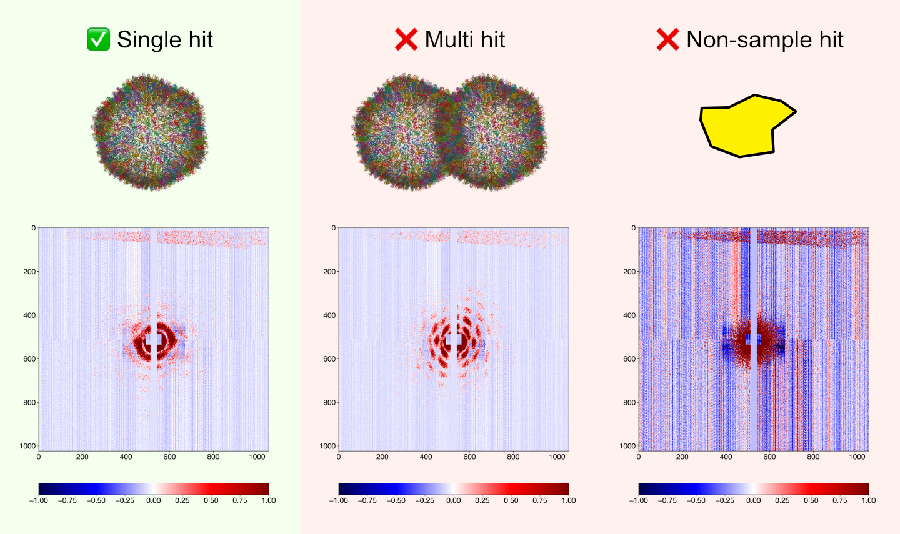
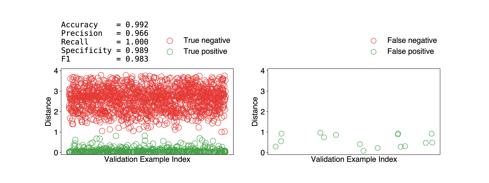
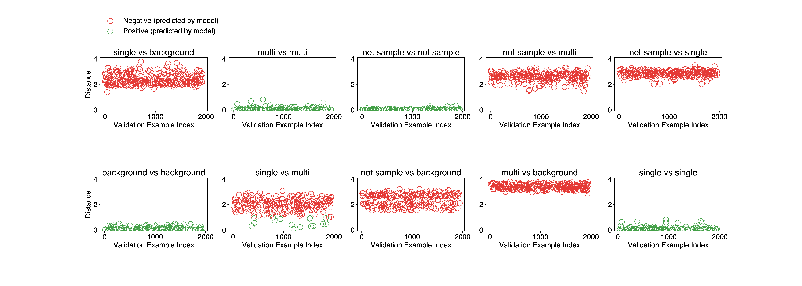

# Deepprojection



Deepprojection is a hit classifier for single particle imaging (SPI)
experiments.  The primary goal of the classifier is to identify *single-hit*s in
a dataset.  The classifier achieved an accuracy of 99%, which was trained on 200
experimental scattering images and tested against 140 other images.  The
training time is around 15-20 min on a NVIDIA 1080 Ti.  It still had an accuracy
of 90% when only 100 images were used for training, which means we can deploy it
for *hit* classification even when the data collection is still underway.  The
classifier can perform classification at nearly 450Hz on the same GPU (1080Ti).  

## Installation

- Direct from github with `pip` (Recommended)

  ```bash
  pip install git+https://github.com/carbonscott/deepprojection --upgrade --user
  ```

- Download and pip

  ```bash
  cd <path_to_deepprojection>    # e.g. cd $HOME/codes/deepprojection

  pip install . --user
  ```

- Download and change `PYTHONPATH`

  ```bash
  export PYTHONPATH="<path_to_deepprojection>:$PYTHONPATH"
  ```


## Install dependencies with `conda`

### Create an environment at a custom location for the project

```bash
conda create --prefix <path> python=3.7
```

### Install `psana`

```bash
conda install -c lcls-rhel7 psana-conda
```

### Install other packages

- `pytorch`

  ```bash
  conda install pytorch=1.4.0=py3.7_cuda10.1.243_cudnn7.6.3_0 -c pytorch
  ```

- `tqdm`

  ```bash
  conda install tqdm=4.56.2=pyhd8ed1ab_0 -c conda-forge
  ```

- `skimage`

  ```bash
  conda install scikit-image=0.18.1=py37hdc94413_0 -c conda-forge
  ```

<!--

## Datasets

### Three scenarios

Each scattering image, captured by a PnCCD detector, consists of four panels.
Deepprojection classifier is able to perform training and inference on
**panels**, **stacks of panels**, and **whole images**, respectively.  

### Experiment vs Simulation

The classifier has been tested on both **experimental** and **simulated**
images.  In particular, simulation is performed by [skopi](https://github.com/chuckie82/skopi).  


## Run examples

All three scenarios in the above section are supported.  **Panels** of
**simulated** images are used in the following demo.  

- Specify metadata, e.g. basename, path and labels associated with SPI image files, in
  a `.csv` file.  

  ```bash
  basename,label,path
  5A1A.1_hit,1,/reg/data/ana03/scratch/cwang31/scratch/skopi/h5s
  6KPI.3_hit,2,/reg/data/ana03/scratch/cwang31/scratch/skopi/h5s
  6M54.1_hit,1,/reg/data/ana03/scratch/cwang31/scratch/skopi/h5s
  6TSH.3_hit,2,/reg/data/ana03/scratch/cwang31/scratch/skopi/h5s
  6XLU.1_hit,1,/reg/data/ana03/scratch/cwang31/scratch/skopi/h5s
  6ZK9.4_hit,2,/reg/data/ana03/scratch/cwang31/scratch/skopi/h5s
  7DDE.1_hit,1,/reg/data/ana03/scratch/cwang31/scratch/skopi/h5s
  7FIE.2_hit,2,/reg/data/ana03/scratch/cwang31/scratch/skopi/h5s
  7K3W.3_hit,2,/reg/data/ana03/scratch/cwang31/scratch/skopi/h5s
  ```

- Train.

  ```bash
  python train.simulated_panel.py
  ```

  A log file with a time stamp will be generated under `logs`, such as
  `<timestamp>.train.log`

- Check learning curves during training.  Open `alog.learncurve.py` and change
  the time stamp in the example file.  

  ```bash
  python alog.learncurve.py
  ```

- Validate.  Open `validate.simulated_panel.query.py` and change the time stamp
  in the example file.  

  ```
  python validate.simulated_panel.query.py
  ```

  Query is one way of validating model performance, which is threshold free.  

- Print confusion matrix.  Open `alog.validate.query.py` and change the time stamp
  in the example file.

  ```bash
  python alog.validate.query.py
  ```

  Sample output (Two categories in simulated datasets, four in experimental datasets):

  ```bash
                 single hit   multi hit    accuracy   precision      recall specificity          f1
  -------------------------------------------------------------------------------------------------
  single hit  |        1845         174        0.92        0.91        0.92        0.91        0.92
   multi hit  |         159        1822        0.92        0.92        0.91        0.92        0.92
  ```
-->


<!--
## Training/validation workflow

As a prerequisite, go to the project folder.  

```
cd $PROJECT    # Skip it if you have already been in the project directory.
```

### Obtain required files

Example Python files and a label file (in `.csv`) are provided in the `examples`
direcotry.  To simply replicate training or validation in the example files, do
the following.  

```
# Copy example Python files from the example directory to a specific project direcotry...
cp $PACKAGE/examples/*.py $PROJECT

# Copy example label files from the example directory to a specific project direcotry...
cp $PACKAGE/examples/*.csv $PROJECT
```

### Start training

```
python train.py
```

Training parameters like the number of training examples can be specified in the
`train.py`.  

### How to monitor the progress of training?

Every training session is logged into a log file (`.train.log`) under `logs`.  `logs`
direcotry will be created by `train.py` if absent.  It's a text file which can
be opened by `less` or a text editor like `vim`.  The training parameters are
logged in the beginning of a log file, followed by the neural network
architecture.  Subsequently, each triplet training examples as input to the
Siamese network are also logged.  Meanwhile, loss value of each iteration of
batch is logged too.  

Each training session has a timestamp assigned to it when it's launched.  To
monitor the loss value during a particular training session, find its timestamp
(the recent one can be identified with `ls -lrt logs` command) and then simply do

```
grep -E 'loss' logs/<timestamp>.train.log
```

### Start validation

Firstly, find the training model you want to validate by checking its timestamp
in the `logs` directory.  

Specify the timestamp in the `validate.pair.py`, open this file with your text
editor (`vim`, `emacs`, etc).  Find the `timestamp` variable and assign the
timestamp you want to validate to this variable.  For example, if I want to
check `20220215220550`, then do the following,

```
timestamp = "20220215220550"
```

Other validation parameters like the number of validation examples can be
specified in the `validate.pair.py` as well.  

Then, simply run

```
python validate.pair.py
```

This will produce a `.validate.pair.log` file under `logs` directory.  You can
open the file with a text editor.  Another thing to do is to plot some
diagnostic figures, which will be discussed in the following section.

### Diagnose the model

Some simple visualization can be made by analyzing the log files, specifically
`.validate.pair.log`.  A few log file analyzer, called `alog.*.py`, are made for
this purpose.  `alog` stands for "analyze log".  


```
python alog.validate.pair.py
```

The above command should produce a figure, shown below, which breaks down the
true/false positive/negative.  



Moreover, a breakdown of above information can be done by running

```
python alog.validate.pair.brkdwn.py
```

This will show which cases are handeled well well by the training model, and
vice versa.  An example figure is shown below.  




## Caveats

The `.csv` label file is an indirect to true label files `.label.json`, which
are located under `$PSOCAKE_PROJECT`.  `$PSOCAKE_PROJECT` is specified in the
last column of the `.csv` file.  For example, if the `datasets.csv` has the
following contents,

```
exp,run,mode,detector,drc
amo06516,90,idx,pnccdFront,/reg/data/ana03/scratch/cwang31/scratch/spi
amo06516,91,idx,pnccdFront,/reg/data/ana03/scratch/cwang31/scratch/spi
amo06516,94,idx,pnccdFront,/reg/data/ana03/scratch/cwang31/scratch/spi
amo06516,102,idx,pnccdFront,/reg/data/ana03/scratch/cwang31/scratch/spi
```

then `/reg/data/ana03/scratch/cwang31/scratch/spi` is the `$PSOCAKE_PROJECT`
directory.  

Because four runs (90, 91, 94, 102) are selected for dataset `amo06516`.  As a
result, the following four directories should be ready too.

```
$PSOCAKE_PROJECT/amo06516/cwang31/psocake/r0090
$PSOCAKE_PROJECT/amo06516/cwang31/psocake/r0091
$PSOCAKE_PROJECT/amo06516/cwang31/psocake/r0094
$PSOCAKE_PROJECT/amo06516/cwang31/psocake/r0102
```

`.cxi` and `.label.json` are also required for each run.  

The following actions might suffice for a quick way to start training or
validation by reusing my labels.  

```
USERNAME=$(whoami)
cd $PSOCAKE_PROJECT

mkdir -p $PSOCAKE_PROJECT/amo06516/$USERNAME/psocake/

ln -s /reg/data/ana03/scratch/cwang31/scratch/spi/amo06516/cwang31/psocake/r0090 \
      $PSOCAKE_PROJECT/amo06516/$USERNAME/psocake/r0090

ln -s /reg/data/ana03/scratch/cwang31/scratch/spi/amo06516/cwang31/psocake/r0091 \
      $PSOCAKE_PROJECT/amo06516/$USERNAME/psocake/r0091

ln -s /reg/data/ana03/scratch/cwang31/scratch/spi/amo06516/cwang31/psocake/r0094 \
      $PSOCAKE_PROJECT/amo06516/$USERNAME/psocake/r0094

ln -s /reg/data/ana03/scratch/cwang31/scratch/spi/amo06516/cwang31/psocake/r0102 \
      $PSOCAKE_PROJECT/amo06516/$USERNAME/psocake/r0102
```
-->
