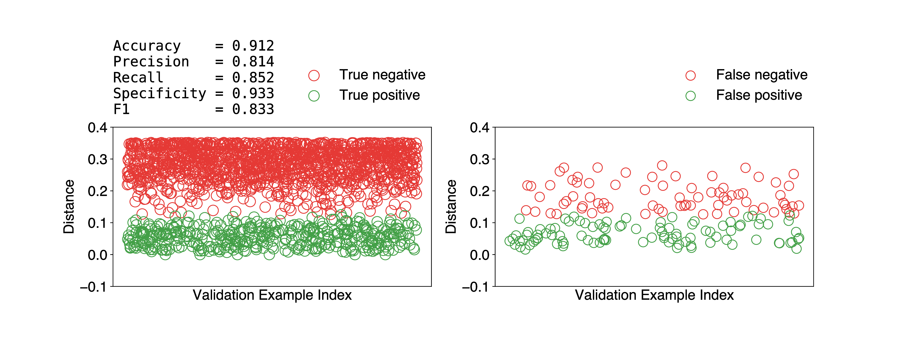
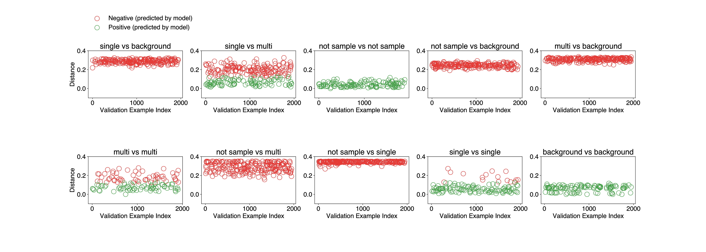

## Install with pip

### From github

```
pip install git+https://github.com/carbonscott/deepprojection --upgrade --user
```

### From a local directory (suitable for development)

```
cd <path_to_this_package>    # e.g. cd $HOME/codes/deepprojection

pip install . --user
```

To apply any updates, simply rerun the above `pip` command.  


### Using `PYTHONPATH`

```
export PYTHONPATH="<path_to_this_package>:$PYTHONPATH"
#
# e.g. 
# export PYTHONPATH="$HOME/codes/deepprojection:$PYTHONPATH"
```

The `<path_to_this_package>` will be referred to as `$PACKAGE` in the following
discussion.


## Which python environment to use on `psana`?

Python enivronment on `psana`

```
# Source the base Python environment on psana...
source /reg/g/psdm/etc/psconda.sh -py3

# Source the ML environment on psana ...
# I set it up in the following address, you can source your own ML environment.
conda activate /reg/data/ana03/scratch/cwang31/conda/ana-py3
```


## Project directory

A project directory would be required for training and validation.  For example, 
I use `/reg/data/ana03/scratch/cwang31/spi` on `psanagpu` nodes.  This project
directory will be referred to as `$PROJECT` throughout this document.  


## Training/validation workflow

As a prerequisite, go to the project folder.  

```
cd $PROJECT    # Skip it if you have already been in the project directory.
```

### Obtain required files

Example Python files and a label file (in `.csv`) are provided in the `examples`
direcotry.  To simply replicate training or validation in the example files, do
the following.  

```
# Copy example Python files from the example directory to a specific project direcotry...
cp $PACKAGE/examples/*.py $PROJECT

# Copy example label files from the example directory to a specific project direcotry...
cp $PACKAGE/examples/*.csv $PROJECT
```

### Start training

```
python train.py
```

Training parameters like the number of training examples can be specified in the
`train.py`.  

### How to monitor the progress of training?

Every training session is logged into a log file (`.train.log`) under `logs`.  `logs`
direcotry will be created by `train.py` if absent.  It's a text file which can
be opened by `less` or a text editor like `vim`.  The training parameters are
logged in the beginning of a log file, followed by the neural network
architecture.  Subsequently, each triplet training examples as input to the
Siamese network are also logged.  Meanwhile, loss value of each iteration of
batch is logged too.  

Each training session has a timestamp assigned to it when it's launched.  To
monitor the loss value during a particular training session, find its timestamp
(the recent one can be identified with `ls -lrt logs` command) and then simply do

```
grep -E 'loss' logs/<timestamp>.train.log
```

### Start validation

Firstly, find the training model you want to validate by checking its timestamp
in the `logs` directory.  

Specify the timestamp in the `validate.pair.py`, open this file with your text
editor (`vim`, `emacs`, etc).  Find the `timestamp` variable and assign the
timestamp you want to validate to this variable.  For example, if I want to
check `20220215220550`, then do the following,

```
timestamp = "20220215220550"
```

Other validation parameters like the number of validation examples can be
specified in the `validate.pair.py` as well.  

Then, simply run

```
python validate.pair.py
```

This will produce a `.validate.pair.log` file under `logs` directory.  You can
open the file with a text editor.  Another thing to do is to plot some
diagnostic figures, which will be discussed in the following section.

### Diagnose the model

Some simple visualization can be made by analyzing the log files, specifically
`.validate.pair.log`.  A few log file analyzer, called `alog.*.py`, are made for
this purpose.  `alog` stands for "analyze log".  


```
python alog.validate.pair.py
```

The above command should produce a figure, shown below, which breaks down the
true/false positive/negative.  



Moreover, a breakdown of above information can be done by running

```
python alog.validate.pair.brkdwn.py
```

This will show which cases are handeled well well by the training model, and
vice versa.  An example figure is shown below.  




## Caveats

The `.csv` label file is an indirect to true label files `.label.json`, which
are located under `$PSOCAKE_PROJECT`.  `$PSOCAKE_PROJECT` is specified in the
last column of the `.csv` file.  For example, if the `datasets.csv` has the
following contents,

```
exp,run,mode,detector,drc
amo06516,90,idx,pnccdFront,/reg/data/ana03/scratch/cwang31/scratch/spi
amo06516,91,idx,pnccdFront,/reg/data/ana03/scratch/cwang31/scratch/spi
amo06516,94,idx,pnccdFront,/reg/data/ana03/scratch/cwang31/scratch/spi
amo06516,102,idx,pnccdFront,/reg/data/ana03/scratch/cwang31/scratch/spi
```

then `/reg/data/ana03/scratch/cwang31/scratch/spi` is the `$PSOCAKE_PROJECT`
directory.  

Because four runs (90, 91, 94, 102) are selected for dataset `amo06516`.  As a
result, the following four directories should be ready too.

```
$PSOCAKE_PROJECT/amo06516/cwang31/psocake/r0090
$PSOCAKE_PROJECT/amo06516/cwang31/psocake/r0091
$PSOCAKE_PROJECT/amo06516/cwang31/psocake/r0094
$PSOCAKE_PROJECT/amo06516/cwang31/psocake/r0102
```

`.cxi` and `.label.json` are also required for each run.  

The following actions might suffice for a quick way to start training or
validation by reusing my labels.  

```
USERNAME=$(whoami)
cd $PSOCAKE_PROJECT

mkdir -p $PSOCAKE_PROJECT/amo06516/$USERNAME/psocake/

ln -s /reg/data/ana03/scratch/cwang31/scratch/spi/amo06516/cwang31/psocake/r0090 \
      $PSOCAKE_PROJECT/amo06516/$USERNAME/psocake/r0090

ln -s /reg/data/ana03/scratch/cwang31/scratch/spi/amo06516/cwang31/psocake/r0091 \
      $PSOCAKE_PROJECT/amo06516/$USERNAME/psocake/r0091

ln -s /reg/data/ana03/scratch/cwang31/scratch/spi/amo06516/cwang31/psocake/r0094 \
      $PSOCAKE_PROJECT/amo06516/$USERNAME/psocake/r0094

ln -s /reg/data/ana03/scratch/cwang31/scratch/spi/amo06516/cwang31/psocake/r0102 \
      $PSOCAKE_PROJECT/amo06516/$USERNAME/psocake/r0102
```
